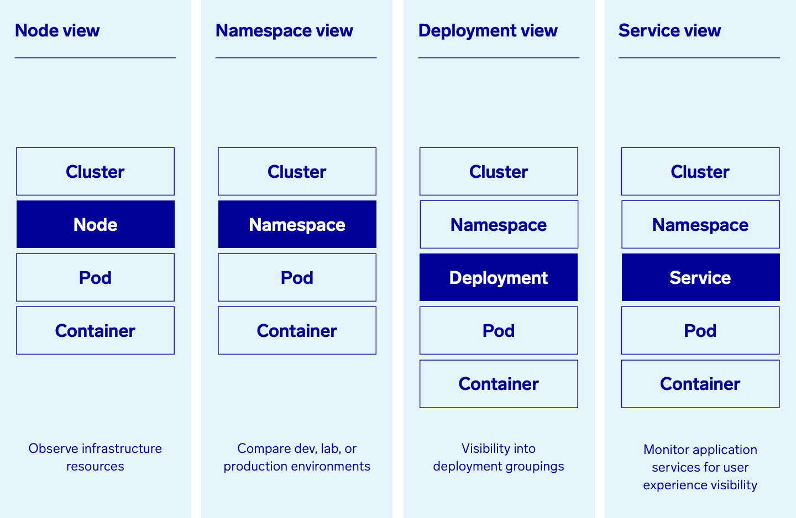
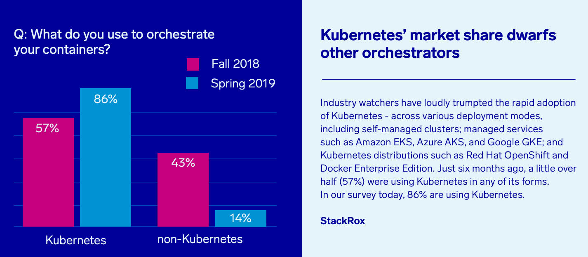
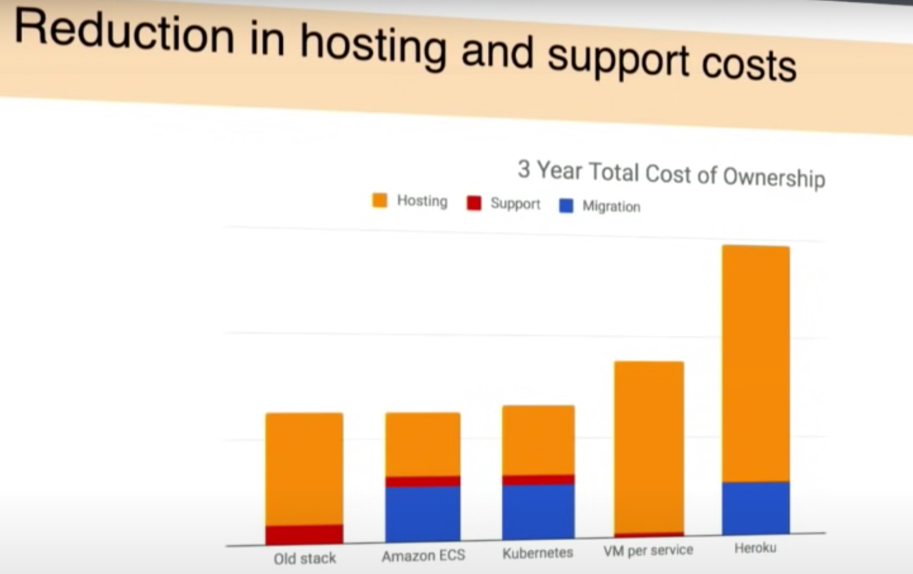
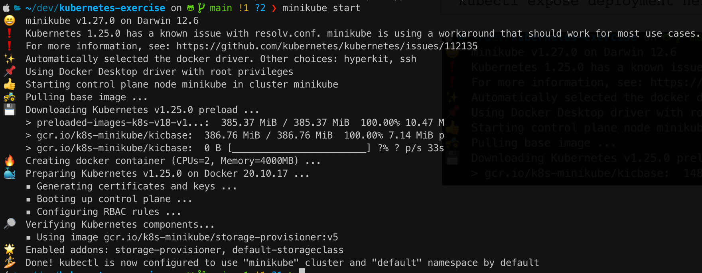
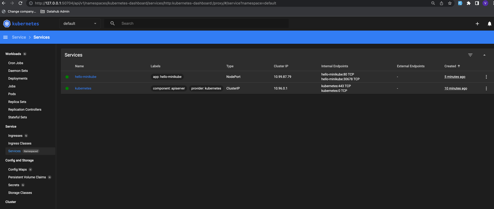
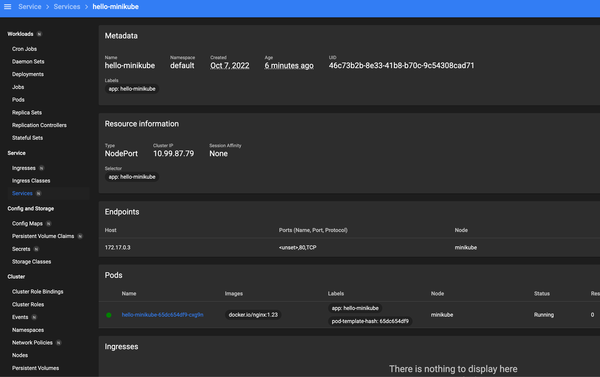
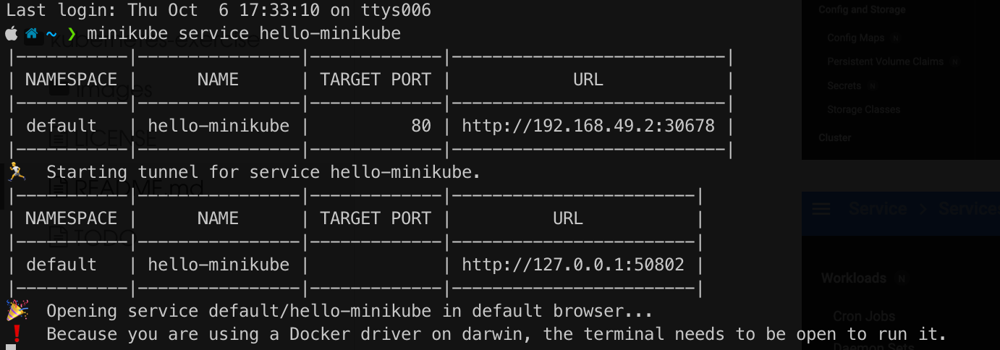
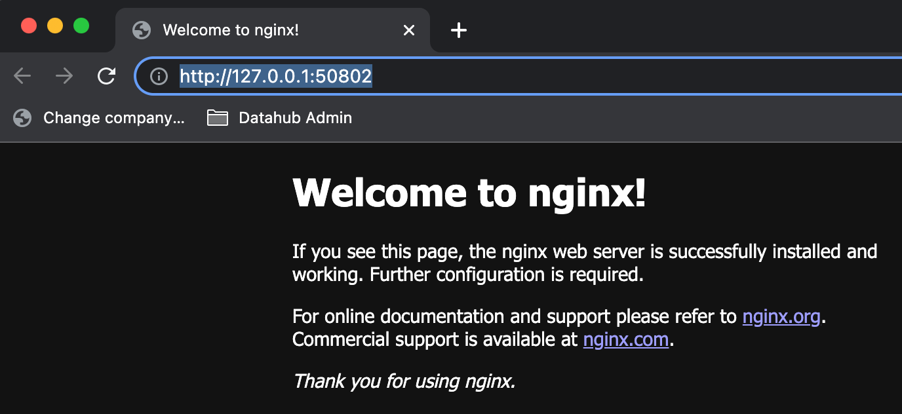

# kubernetes exercise

[TOC]

## Introduction

This repository is to collate and investigate [Kubernetes](https://kubernetes.io/), to get familiar with the API, to investigate alternatives for generating [Cloud Foundry](https://www.cloudfoundry.org/) projects into the K8s platform, or some other alternative, like AWS copilot.


Kubernetes (also known as k8s or “kube”) is **an open source container orchestration platform that automates many of the manual processes involved in deploying, managing, and scaling containerized applications**. The name Kubernetes originates from Greek, meaning helmsman or pilot. K8s as an abbreviation results from counting the eight letters between the "K" and the "s". Google open-sourced the Kubernetes project in 2014. Kubernetes combines [over 15 years of Google's experience](https://kubernetes.io/blog/2015/04/borg-predecessor-to-kubernetes/) running production workloads at scale with best-of-breed ideas and practices from the community.

A lot of systems don't need Kubernetes, but for **mission critical** enterprise scale applications, where downtime can be costly, we need more than just an in-house library to take care of the service orchestration.

- **MiniKube** (for a single PC)
- **MicroK8s** (IoT) (for multiple nodes)

Kubernetes is not a traditional, all-inclusive **PaaS (Platform as a Service)** system.

Each server is called a **Node**. There are **Master** *(Control Plane)* and **Worker Nodes** (Kubelet and K-proxy.) As the names suggest, the master takes care of the orchestration and the worker is the one that really handles the work. One node has several containers running in **Pods**.

A **scheduler** - that takes care of allocating the right worker node for any container to run and should have a way to monitor the state of each of the worker nodes.There is a need to store the state of the entire cluster disaster recovery sake. Similarly, each container should have a way to store any persistent data.

### Pods

- A pod is the unit of **scheduling** in Kubernetes.
- It is a resource envelope in which one or more containers run, mostly docker or a container.
- Pods extracts **logs** generated and pushes this to the cluster logs.
- A Pod can have **multiple containers**.
- Each Pod has an IP address in the Cluster Internal IP Space facilitating communication among microservices.

### Service

- Everything in Kubernetes is, by design, ephemeral and can be terminated, scaled at any moment.
- IP addresses are dynamic so a service envelopes all the pods of a given microservice, and provides a consistent URL for invoking that service and scales and load balances adequately.

### Deployment

-  This can be considered as a template that defines how a new Pod can be created for the given Service.
- Contains the details of how the Pod should communicate with the outside

### Kubelet

- Takes care of **reporting** and implementing the **instructions**.
- Track **status** of the node in detail - the CPU, memory utilization of the worker nodes.
- It takes care of periodically running the **health check** on each pod, to make sure it is active.
- *The Control Plane* can instruct it to terminate a given pod or create new ones. *The Kubelet* takes care of executing these instructions.

### Kubeproxy

- Microservices may expose an external API, or access some external API's by the KubeProxy. As the name suggests, it acts as a simple proxy server on the node.

### API Server

- [Dashboard UI](https://kubernetes.io/docs/reference/command-line-tools-reference/kube-apiserver/), API for automating technologies, CLI tool

### Scheduler

- Responsible for scheduling the pods on worker nodes.
- When choosing a worker node, it has to take care of several factors. We cannot have all pods of the a deployment on the same node.




## Why Kubernetes?

There’s a revolution going on. Actually, three revolutions:

1. The first revolution is the creation of the **cloud**.
2. The second is the dawn of **DevOps**.
3. The third revolution is the coming of **containers**.

Together, these three waves of change are creating a new software world: the cloud native world. The operating system for this world is called **_Kubernetes_**.

Kubernetes supports:

1. **Automated** *rollouts* and *rollbacks*
2. **Service** discovery and load balancing
3. **Storage** orchestration
4. **Secret** and **configuration** management
5. Automatic **bin packing**
6. **Batch** execution
7. **IPv4/IPv6** dual-stack
8. **Horizontal scaling**
9. **Self-healing**
10. Designed for **extensibility**

Kubernetes have fast become the most *popular** choice, which will make this skill more marketable and long lived.



**Business people** like a reduction in costs, and so if this has the potential to be cheaper and more reliable, it will be easier to convince adding this to the radar.



## Getting started

- Install kubectl
  - [Linux](https://kubernetes.io/docs/tasks/tools/install-kubectl-linux)
  - [macOS](https://kubernetes.io/docs/tasks/tools/install-kubectl-macos)
  - [Windows](https://kubernetes.io/docs/tasks/tools/install-kubectl-windows)
- Install [**Minikube**](https://minikube.sigs.k8s.io/docs/start/) if you want to run this locally and play for free



```bash
# Setup Mac OS e.g.
brew install kubernetes-cli
# Learn locally
alias kubectl="minikube kubectl --"
brew install minikube
# Run 
minikube start
# Deploy applications
kubectl create deployment hello-minikube --image=docker.io/nginx:1.23
kubectl expose deployment hello-minikube --type=NodePort --port=80
# Show dashboard and see below for output
minikube dashboard
```





Get the service by `minikube service hello-minikube`





Altering existing configuration settings

```bash
# These changes will take effect upon a minikube delete and then a minikube start
minikube config set memory 16384

minikube kubectl -- get po -A
```

Finally cleaning up

```bash
minikube stop
minikube delete --all
```

# References

- [Kubernetes developer guide](https://blog.thewiz.net/understanding-kubernetes-developers-guide)
- [Kubectl cheatsheet](https://kubernetes.io/docs/reference/kubectl/cheatsheet/)
- [Build packs](https://paketo.io/)
